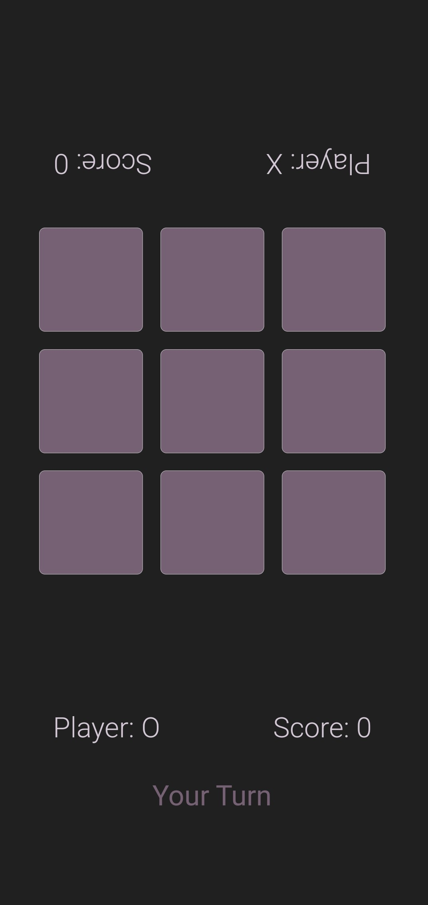
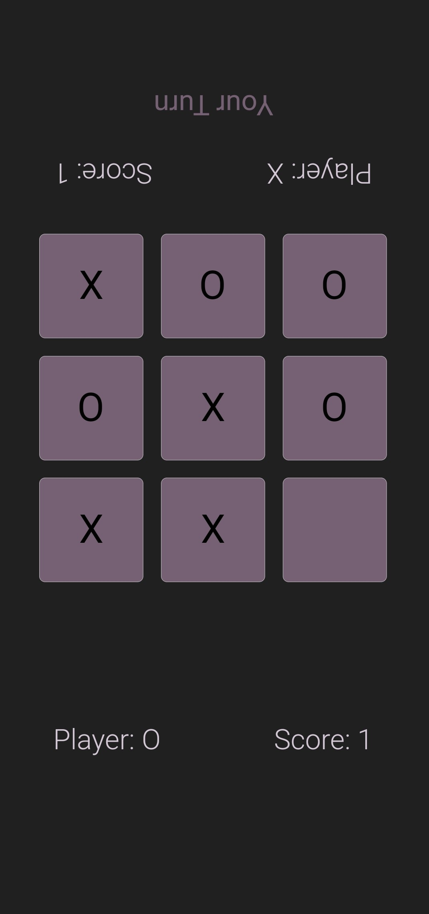
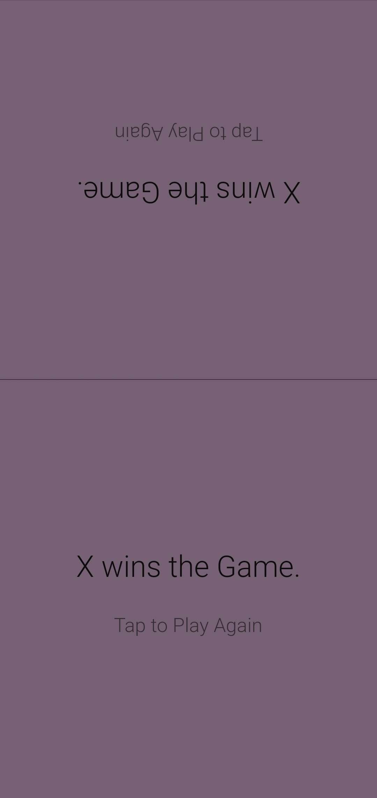
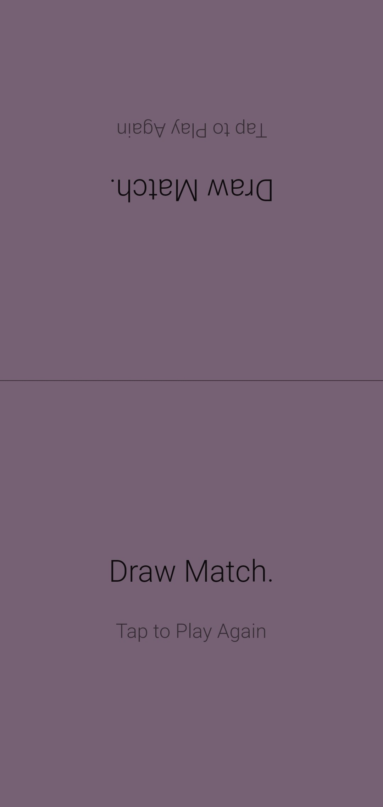
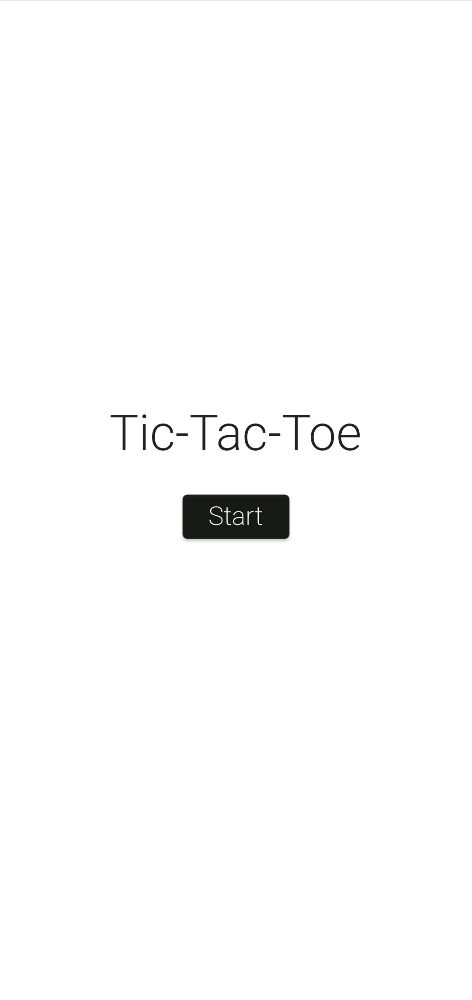
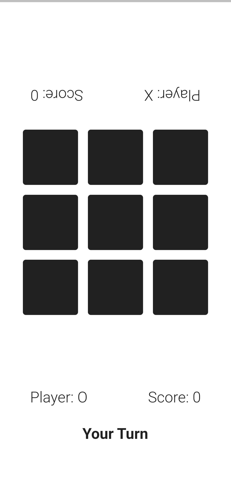
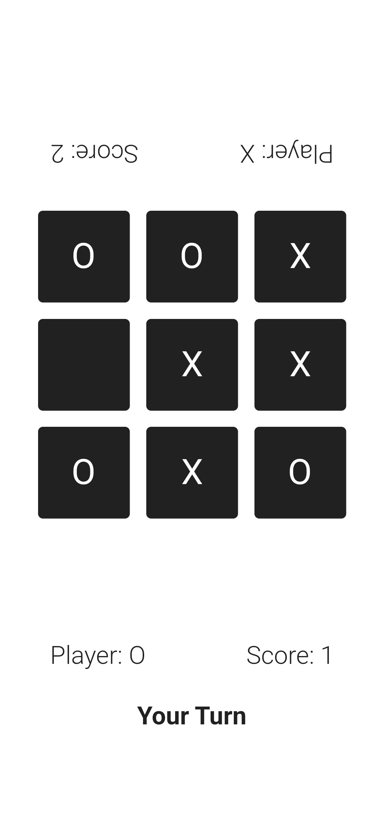
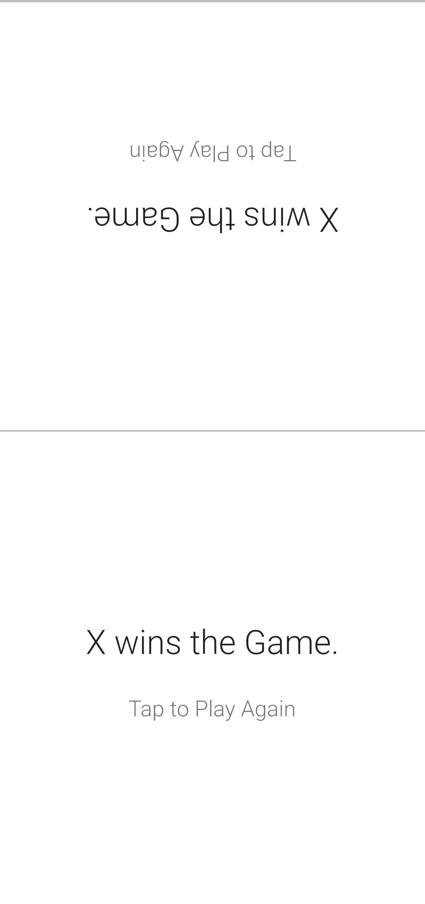
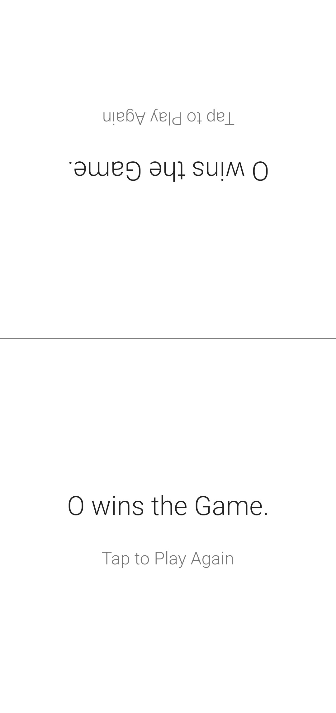

<h1 align="center">
Tic-Tac-Toe
</h1>

<h6 align='right'><a href = 'https://github.com/nishanth1000/TicTacToe-FlutterApp/releases/download/v0.1.1/tictactoe.apk'>Download the App </a></h6>

• An offline Tic-Tac-Toe apk. 
• Built using Flutter

## Features
• In addition to the classic Tic-Tac-Toe, this game allows the players to sit opposite and play the game, instead of swapping their mobile phones for each of their turns.

## Screenshots
#### Updated UI Design
<pre>
     
</pre>

#### Old UI Design
<pre>
     
</pre>
